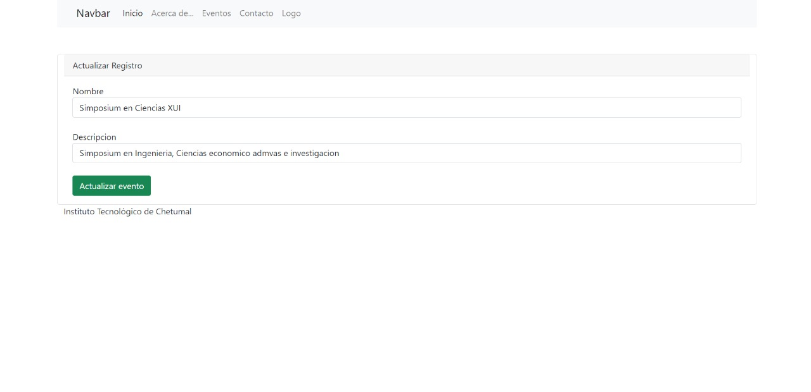

# CRUD Laravel 8.0 y Mysql

# Prueba de concepto 

Events index (contiene delete)
 
 
Crear eventos
 
 
 
Actualizar evento
 
 
 
El script de creación de la BD está en la raíz del repositorio. Se llama:
validdoc.sql
